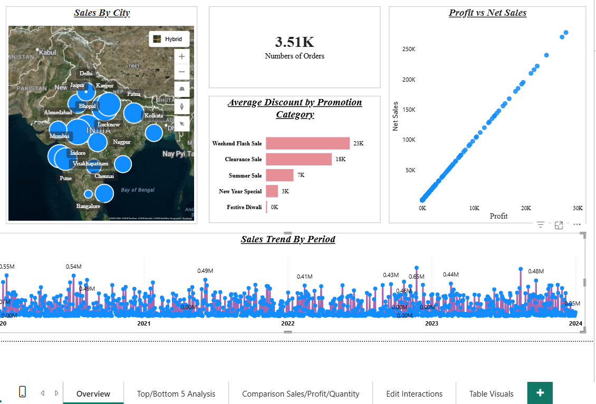
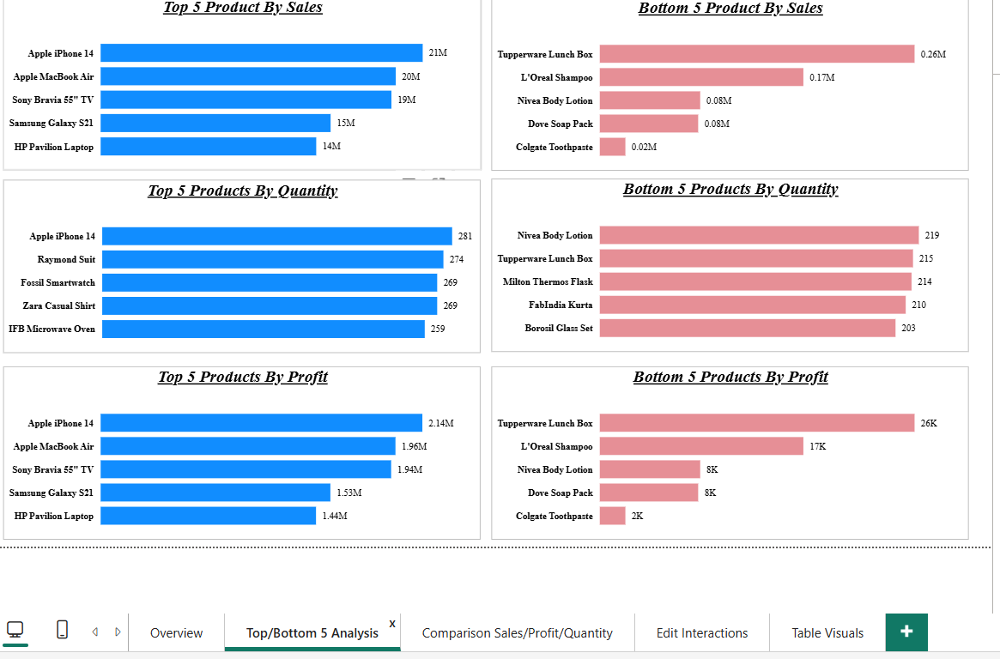

# 📊 Sales Analysis Dashboard | Power BI

An interactive Power BI dashboard designed to analyze sales performance, profitability, product performance, promotions, orders, and city-wise sales through interactive visualizations and filters.

---

## 📌 Project Overview

The **Sales Analysis Dashboard** is an interactive Business Intelligence project built using Power BI to provide a comprehensive view of sales performance.

The dashboard allows users to analyze sales, profit, quantity sold, orders, discounts, products, promotions, customers, dates, and cities through multiple analytical views.

It helps users identify top and bottom-performing products, understand sales trends over time, evaluate the relationship between sales and profit, compare performance across different periods, and explore detailed order-level information.

---

## 🛠️ Tech Stack

The dashboard was built using the following tools and technologies:

- 📊 **Power BI Desktop** – Main platform used for dashboard development and data visualization.
- 🧠 **DAX** – Used for calculated measures, KPIs, comparisons, and analytical calculations.
- 🔄 **Power Query** – Used for data transformation and preparation.
- 🗂️ **Data Modeling** – Used to establish relationships between fact and dimension tables.
- 📁 **Power BI Project (PBIP)** – Used to maintain the report and semantic model separately.
- 🔧 **Git & GitHub** – Used for project version control and repository management.

---

## 🗃️ Data Model

The Power BI semantic model includes the following tables:

- **Fact Table** – Contains sales transaction data.
- **Dim Customers** – Contains customer-related information.
- **Dim Product** – Contains product-related information.
- **Dim Promotion** – Contains promotion-related information.
- **Date Tables** – Used for time-based analysis and filtering.

The data model enables analysis across:

**Customers → Products → Promotions → Dates → Sales → Profit → Quantity**

---

# 🎯 Business Problem

Sales data contains information across products, customers, promotions, orders, dates, and cities. Analyzing these dimensions separately can make it difficult to quickly identify sales performance, profitability, product performance, and changing sales trends.

The business requires an interactive dashboard to answer key questions such as:

- Which products are the **Top/Bottom 5** based on Sales, Profit, and Quantity Sold?
- How do **sales trends vary over time** across daily, monthly, quarterly, and annual periods?
- What is the **relationship between Sales and Profit**?
- How do **Sales, Profit, and Quantity Sold** compare between two user-selected periods?
- What is the **average discount offered in each promotion category**?
- What is the **total number of orders**?
- How do individual orders perform based on **Sales, Profit, Discount, Net Sales, and other available fields**?
- Which **cities generate higher sales**?

---

# 🎯 Goal of the Dashboard

The goal of the dashboard is to provide an interactive analytical solution that enables users to:

- Monitor overall sales and profitability.
- Identify high- and low-performing products.
- Analyze sales trends across different time periods.
- Understand the relationship between sales and profit.
- Compare sales, profit, and quantity between selected periods.
- Evaluate average discounts across promotion categories.
- Analyze order-level performance using interactive filters.
- Understand sales distribution across different cities.

---

# 📊 Dashboard Features & Highlights

## 1. Overview Dashboard

The **Overview** page provides a high-level summary of overall sales performance.

### Key KPIs

- 💰 **Total Sales:** 122M
- 📈 **Total Profit:** 12.2M
- 📦 **Total Quantity Sold:** 7.1K
- 🧾 **Number of Orders:** 3.51K

### Key Visuals

#### 🗺️ Sales by City

A geographic visualization showing sales distribution across different cities.

This provides a quick view of the locations contributing to sales performance.

#### 🎯 Average Discount by Promotion Category

A bar chart comparing the average discount offered across different promotion categories, including:

- Weekend Flash Sale
- Clearance Sale
- Summer Sale
- New Year Special
- Festive Diwali

#### 📈 Profit vs Net Sales

A scatter plot showing the relationship between **Profit** and **Net Sales**.

This helps understand how profitability changes with net sales.

#### 📅 Sales Trend by Period

A time-series visualization showing sales activity across the period from **2020 to 2024**.

The visualization helps identify fluctuations and patterns in sales over time.

---

# 🏆 2. Top / Bottom 5 Product Analysis

This page focuses on identifying the highest- and lowest-performing products.

The analysis is performed across three major metrics:

- Sales
- Quantity Sold
- Profit

### Top 5 Products by Sales

- Apple iPhone 14
- Apple MacBook Air
- Sony Bravia 55" TV
- Samsung Galaxy S21
- HP Pavilion Laptop

### Top 5 Products by Quantity

- Apple iPhone 14
- Raymond Suit
- Fossil Smartwatch
- Zara Casual Shirt
- IFB Microwave Oven

### Top 5 Products by Profit

- Apple iPhone 14
- Apple MacBook Air
- Sony Bravia 55" TV
- Samsung Galaxy S21
- HP Pavilion Laptop

The page also provides **Bottom 5 analysis** based on:

- Sales
- Quantity Sold
- Profit

This allows users to quickly identify both high-performing and low-performing products.

---

# 🔄 3. Sales / Profit / Quantity Comparison

The **Comparison Sales/Profit/Quantity** page allows users to compare two different date periods.

Two independent date filters can be used to select the required periods.

The dashboard compares:

- **Total Sales**
- **Total Profit**
- **Total Quantity Sold**

This provides an easy way to evaluate performance between two selected periods.

---

# 🔎 4. Interactive Filters & Order-Level Analysis

The dashboard provides interactive filters that allow users to explore detailed sales information.

### Available Filters

- Promotion Name
- Product Name
- Customer Name
- Date

### Detailed Order Information

The table visual provides transaction-level information including:

- Customer ID
- Order ID
- Product ID
- Promotion ID
- Date
- Total Discount
- Discount Percentage
- Net Sales
- Price Per Unit
- Profit
- Total Sales
- Units Sold

Users can combine the filters to investigate specific products, customers, promotions, or dates.

---

# 💼 Business Impact

### 📊 Sales Performance Monitoring

Provides a centralized view of sales, profit, quantity sold, and order performance.

### 🏆 Product Performance Analysis

Top and Bottom 5 analysis helps identify products with strong and weak performance across Sales, Profit, and Quantity Sold.

### 📅 Time-Based Analysis

Sales trend analysis helps users understand how sales performance changes over different periods.

### 💰 Profitability Analysis

The Sales vs Profit visualization helps understand the relationship between sales and profitability.

### 🎯 Promotion Analysis

Average discount analysis provides visibility into discount levels across different promotion categories.

### 🌍 City-Level Analysis

Sales by city helps identify geographic differences in sales performance.

### 🔍 Detailed Data Exploration

Interactive filters and transaction-level tables allow users to move from high-level KPIs to detailed order information.

---

# 📸 Dashboard Screenshots

## Overview



The Overview page provides KPIs, city-wise sales, promotion discount analysis, profit vs net sales, and sales trends.

---

## Top / Bottom 5 Analysis



This page compares the Top 5 and Bottom 5 products based on Sales, Quantity Sold, and Profit.

---

## Sales / Profit / Quantity Comparison


This page enables comparison of Sales, Profit, and Quantity Sold between two selected periods.

---

## Interactive Filters


Interactive date filters and report interactions allow users to compare and analyze different periods.

---

## Table Visuals


The table view provides detailed order-level information with filters for Product, Customer, Promotion, and Date.

---

# 🚀 How to Open the Project

### 1. Clone the Repository

```bash
git clone https://github.com/coderrz/Project1-Sales-Analysis.git
